# PigletNode C3

A standalone ESP-NOW scanning node for the **Piglet** Wi-Fi mesh, ported to the tiny **ESP32-C3 0.42" OLED** board. It scans 2.4 GHz Wi-Fi on the channels its Core assigns and reports every network it hears back to the Core. The 72×40 screen shows a small world: a pixel-art pig trots through it, digs up truffles, hops when it finds a new network, and meets the pigs of other nodes nearby.

<p align="center">
  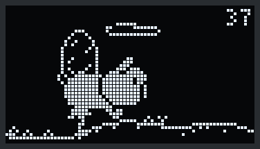
  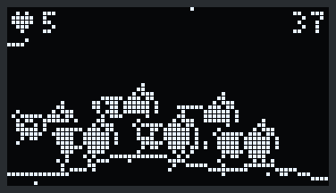
</p>

## One pig per node, up to six

Every Piglet node in range joins the scene with its own pig, so you can count the cluster at a glance. The more pigs there are, the smaller everyone gets. Each node's pig also has its own spot pattern.

| 1 node | 2 nodes | 3 nodes |
|:---:|:---:|:---:|
| 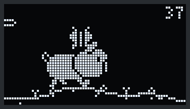 | 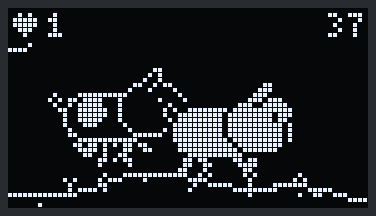 | 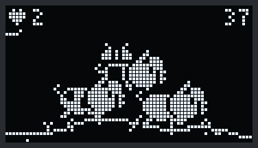 |
| **Full size**, 30×18 | **Full size**; the friend is drawn in outline | **Medium**, 22×13 |
| **4 nodes** | **5 nodes** | **6 nodes** |
|  | 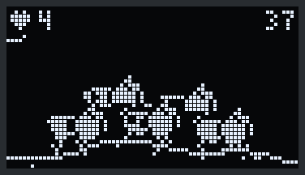 |  |
| **Medium**, two rows | **Small**, 16×10 | **Small**, two rows of three |

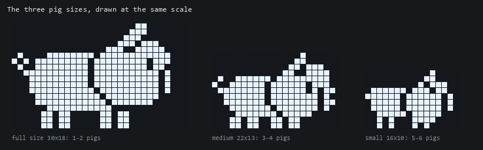

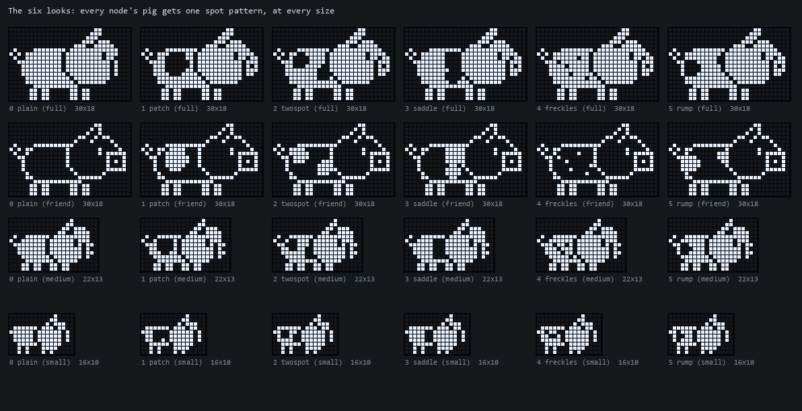

This document explains everything the firmware does: the radio side, the display engine, and every sprite and animation, frame by frame.

---

## Contents

1. [Hardware](#1-hardware)
2. [Building and flashing](#2-building-and-flashing)
3. [Using the node](#3-using-the-node)
4. [How the node works: radio and protocol](#4-how-the-node-works-radio-and-protocol)
5. [Friends, flocks and parties: the node-to-node protocol](#5-friends-flocks-and-parties-the-node-to-node-protocol)
6. [The display engine](#6-the-display-engine)
7. [The sprites](#7-the-sprites)
8. [The animations, one by one](#8-the-animations-one-by-one)
9. [The world: ground, trees, clouds, butterfly](#9-the-world-ground-trees-clouds-butterfly)
10. [The flock](#10-the-flock)
11. [Burn-in protection](#11-burn-in-protection)
12. [The stats page and the channel graph](#12-the-stats-page-and-the-channel-graph)
13. [The sprite pipeline and the Sprite Lab](#13-the-sprite-pipeline-and-the-sprite-lab)
14. [Code map](#14-code-map)
15. [Memory, limits and known behaviour](#15-memory-limits-and-known-behaviour)
16. [Credits and license](#16-credits-and-license)

---

## 1. Hardware

| Part | Detail |
|---|---|
| Board | ESP32-C3 "0.42-inch OLED" dev board (sold under many names) |
| Chip | ESP32-C3, single-core RISC-V at 160 MHz, 4 MB flash, **2.4 GHz only** |
| Screen | SSD1306, **72×40 pixels**, 1-bit (each pixel is on or off), about 9 × 5 mm |
| Screen wiring | I²C, SDA = GPIO5, SCL = GPIO6, run at 400 kHz |
| LED | GPIO8, active LOW (writing 0 turns it on) |
| Button | BOOT button on GPIO9, input with pull-up, LOW when pressed |
| USB | Native USB serial/JTAG (shows up as a USB serial device, VID:PID 303A:1001) |

A pixel on this screen is about 0.13 mm across. That drives many design decisions below: features narrower than 2 pixels tend to disappear at arm's length, so the art relies on bold silhouettes and black cut-outs rather than fine detail.

---

## 2. Building and flashing

The project uses [PlatformIO](https://platformio.org/). Everything is set in [platformio.ini](platformio.ini):

- **Platform:** `pioarduino` 55.03.39 (Arduino-ESP32 3.x). The stock `espressif32` platform ships Arduino 2.x, which lacks the `esp_now_recv_info_t` receive-callback signature this code uses. The version is pinned because newer releases contain file paths longer than 260 characters, which fail to unpack on Windows unless long paths are enabled.
- **Board:** `esp32-c3-devkitm-1`, with `ARDUINO_USB_MODE=1` and `ARDUINO_USB_CDC_ON_BOOT=1` so `Serial` goes over the native USB port.
- **Library:** `olikraus/U8g2` for the screen.

```sh
pio run                                   # build
pio run -t upload --upload-port COM10     # flash (pick your port)
pio device monitor                        # serial output, 115200 baud
```

`pio device list` shows the connected boards. Each ESP32 reports its hardware address as the USB serial number (for example `SER=B8:F8:62:38:57:C4`). The last four hex digits are the node's name on screen, **57C4** in that example. When a Core and several nodes are plugged into the same computer, that number tells you which port is which. The flashing tool checks the chip type before writing, so it refuses to flash a board that isn't an ESP32-C3.

---

## 3. Using the node

**Pages.** A short press of BOOT cycles the screen through three pages:

| Page | Shows |
|---|---|
| **Pig** (default) | The animated world, the unique-network count (top right) and the number of nearby friend nodes (top left) |
| **Channel graph** | How many networks the latest scan found on each 2.4 GHz channel ([section 12](#12-the-stats-page-and-the-channel-graph)) |
| **Stats** | Four rotating panels of detailed numbers ([section 12](#12-the-stats-page-and-the-channel-graph)) |

**Long press.** Holding BOOT for 2 seconds drops the link to the Core and starts searching for one again.

**LED.** It blinks fast (200 ms) while searching for a Core and slowly (1 s) once linked.

**Serial output.** At 115200 baud, every 10 seconds the node prints a status line: Core address, assigned channel range and version, the range actually being scanned, and new/found/sent counts. It also prints one line per friend node it has heard. Events such as "Core found", "Core timed out" and "friend nearby" are printed as they happen.

---

## 4. How the node works: radio and protocol

The node speaks the **JCMK protocol** used by Piglet Cores (and by ESP32 Marauder in its core role). All messages are ESP-NOW broadcasts on **channel 6**, starting with the four magic bytes `ENOW` and a type byte:

| Type | Name | Direction | Meaning |
|---|---|---|---|
| 1 | `CORE_REQUEST` | node → all | "Is there a Core?" |
| 2 | `CORE_REPLY` | Core → node | "I'm a Core" (the node remembers the sender's address) |
| 3 | `HEARTBEAT` | both | "Still here" (the node also hides its friend payload in it, see [section 5](#5-friends-flocks-and-parties-the-node-to-node-protocol)) |
| 4 | `TEXT` | node → Core | One scanned network, as text |
| 5 | `ADMIN` | Core → node | Channel assignment: version, node index/count, start and end channel index |
| 10 | Biscuit config | Core → node | Biscuit-style text config: `channels=1,2,...;dwell=N` |

Text and heartbeat messages use a fixed 212-byte `jcmk_text_msg_t` (magic, type, counter, length, 201 bytes of text). The node always sends the full 212 bytes, because Biscuit Pro Cores drop anything shorter.

### Startup (`setup()`)

1. Serial starts, the LED and button pins are set up, and the screen shows "PigletNode / C3 v2.58-c3 / Booting...".
2. Wi-Fi is fully switched off and then on again in station mode, with auto-reconnect and saving to flash disabled. This gives a clean radio state.
3. ESP-NOW starts. If that fails, the screen shows the error and the LED flickers forever; power-cycle to retry.
4. The radio is set to channel 6 and read back to confirm; if it didn't stick, it tries once more. The broadcast address is added as an ESP-NOW peer, and the node reads its own hardware address (used to choose the party leader).
5. The node waits a **random 0.2–3 s** so that several nodes powered on together don't all shout at the Core at once.

### Finding a Core (`nodeTick()`)

While unlinked, the node broadcasts a `CORE_REQUEST` with **exponential backoff**: first after 300 ms, then doubling each time up to once every 5 s. When a `CORE_REPLY` arrives, the receive callback only records the Core's address and sets a flag. The main loop then does the real work: it marks the node as linked, adds the Core as a peer, and resets the timers. Keeping the callback tiny matters because it runs inside the Wi-Fi task.

### Channel assignment

The Core tells each node which channels to scan, as a start and end **index into a shared channel table**. That table lists 2.4 GHz channels 1–14 followed by the 5 GHz channels. It must match the Core exactly, so it's kept in full even though the C3 can't use 5 GHz.

- An `ADMIN` message is only applied when its assignment version changes, so repeats and stale messages are ignored.
- A Biscuit config message (type 10) gives a list of channels. The node looks up the first and last in the table.
- `effRange()` trims the assignment to 2.4 GHz. If the Core assigned **only** 5 GHz channels, the node falls back to scanning all of 2.4 GHz (1–14) rather than sitting idle, and marks the range with `*` in its status output.

### The scan loop (`scanTick()`)

The node scans one channel at a time, asynchronously, so the screen keeps animating:

```
for each channel in the assigned range:
    start an async active scan on that channel (80 ms dwell, hidden networks included)
    wait for it to finish (checked every loop)
    remember how many networks that channel had        -> channel graph
    switch back to channel 6 and send each network to the Core as a TEXT message
at the end of the range:
    switch to channel 6, send a HEARTBEAT, and listen for 500 ms + 0-200 ms random
    (the "admin window", when the Core can send new assignments; the jitter keeps nodes apart)
```

Each network is sent as one line: `BSSID,SSID,AUTH,channel,RSSI,W`, for example `AA:BB:CC:DD:EE:FF,MyWifi,WPA2,6,-61,W`.

### Counting unique networks (`markSeen()`)

Networks get reported every cycle, so "networks found" grows fast. To count each access point only once, the node keeps a small **hash set of access-point addresses (BSSIDs)**: 1024 slots, each a 32-bit FNV-1a hash of the 6-byte address. It uses open addressing, meaning a clash moves on to the next slot. The first time an address is seen, `markSeen()` returns true, which:

- increases `netNew` (the number shown top right),
- tells the pig to hop,
- adds one to the security-type counters for the stats page.

The set stops accepting new entries at 7/8 full (896 networks). After that, the node keeps scanning and reporting normally, but the unique count and the hops stop.

### Staying linked

- A **heartbeat** goes out at the end of every scan cycle, plus a backup one every 5 s if a scan ever stalls.
- If nothing is heard from the Core for **90 s**, the node assumes the Core is gone and starts searching again. What counts is an `ADMIN` message, a Biscuit config message, or a heartbeat **from the Core's own address**. Other nodes' heartbeats don't count. The original code accepted any heartbeat, so a second node nearby could keep a node thinking its Core was still alive.

---

## 5. Friends, flocks and parties: the node-to-node protocol

Nodes find each other through the heartbeats they already send. The first 11 bytes of the heartbeat's text field carry a small payload. The message's length field stays **0**, so a Core still sees an empty heartbeat and ignores the rest.

| Bytes | Content |
|---|---|
| 0–3 | `"PIG1"` (marks the sender as a Piglet C3 node) |
| 4–7 | The sender's unique-network count (`uint32`, little-endian) |
| 8–9 | Party countdown in 100 ms steps (`uint16`, 0 = no party announced) |
| 10 | Party number (`uint8`) |

**Receiving.** The receive callback copies the sender's address, signal strength (RSSI) and the payload into `friendMsg` and sets a flag. `friendsTick()` handles it in the main loop:

- **Friend table:** up to **6** friends, each with its address, first and last time heard, network count, signal and number of heartbeats heard. A new friend takes a free slot, or replaces the one heard from least recently.
- **Nearby:** a friend counts as nearby if it was heard in the last **45 s**. Nodes only listen on channel 6 during admin windows, so friends are heard every few seconds rather than continuously.
- **Hops:** when a nearby friend's network count goes up, its pig hops on our screen.
- **Names:** a friend is named by the last two bytes of its address in hex, for example `58A8`.

**The party leader.** Among this node and its nearby friends, the one with the **lowest hardware address** leads (`isLowest()`). There's no negotiation: every node works it out the same way from the same information.

1. The leader announces a party **8 s ahead**: it stores the start time, increments the party number, and from then on each heartbeat carries the time remaining.
2. A node that hears a countdown from the node it considers leader, for a party number it hasn't joined yet, sets its own start time to *now + countdown*. All the screens then start the party at about the same moment, even though each hears the countdown at a different time.
3. The leader throws a party when the flock first forms, about 4 s after the flock grows (plus the 8-second countdown), and then every 3–5 minutes.
4. A node that misses the whole countdown skips that party.

---

## 6. The display engine

### The frame loop

`oledTick()` runs from `loop()` and draws a new frame every **50 ms (20 fps)**. The whole 72×40 image (360 bytes) is built in the U8g2 frame buffer and sent over I²C at 400 kHz, which takes about 9 ms. Scanning is asynchronous, so drawing never blocks the radio.

### How a sprite is stored

Every sprite is a 1-bit bitmap in [src/pig_sprites.h](src/pig_sprites.h), generated by the tools in [tools/sprites](tools/sprites). Each **row is one `uint32_t`**; the most significant bit is the leftmost pixel. So a sprite can be up to 32 pixels wide, and a 30×18 pig frame takes 72 bytes.

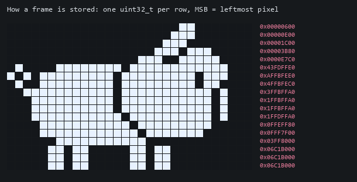

### Drawing: `blit()` and mirroring

`blit(rows, w, h, x, y, flip, color)` walks the bits and plots each set bit in the given colour (1 = lit, 0 = black), skipping pixels outside the screen. With `flip`, column `i` is drawn at `w-1-i`. Every sprite faces right, and **walking left is the same frames drawn mirrored**, which halves the art needed.

### Masks and edges

The pig is drawn over scenery (clouds, trees, grass, other pigs), and its eye and neck line are black *holes* in the white shape. Without extra work, scenery would show through those holes. Each frame therefore has two companion bitmaps, generated automatically:

- **Mask:** the frame's filled silhouette. It's found by flood-filling from the border through empty pixels; everything the fill can't reach is inside the pig. The mask is drawn **black first**, then the frame is drawn white on top, so the pig blocks everything behind it.
- **Edge:** the mask grown by one pixel to the left, right and up, **but not down**, so hooves stay on the ground line. It's used whenever two or more pigs are on screen, so each pig gets a thin black border that separates it from the pig behind.

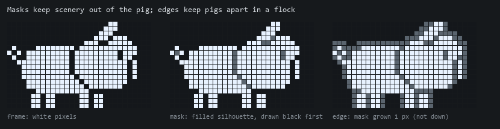

### Draw order (the layers)

Each frame of the pig page is drawn back to front:

1. Clear the screen.
2. **Clouds**
3. **Birds**
4. **Trees**
5. **Ground:** the ground line, pebbles and grass, and any dug hole
6. **Dirt mound** from the latest dig
7. **Butterfly** (behind the pigs, so they hide it as it passes)
8. **Friend pigs:** the back row first, then the front row
9. **Our pig**
10. **Truffle** and sparkles
11. **Particles:** dirt, crumbs, confetti, fireworks
12. **Floating hearts**
13. **Marks:** `!`, `?`, and the sleeping `z`/`Z`
14. **Unique-network count** (top right, on a black box so clouds pass behind it)
15. **Friend badge:** a heart and the number of friends (top left)

### Modes and actions

The pig is driven by two small state machines.

**Mode**, recalculated every frame from the node's state:

| Mode | When | What happens |
|---|---|---|
| **Search** | No Core linked | The pig stands in the middle, sniffing, looking both ways, with a `?` |
| **Trot** | Linked | The world scrolls and the pig walks, broken up by actions |
| **Sleep** | Linked, but no new network and no party for **60 s** | The pig lies down and snores |

Changing mode resets the pig's position, direction and timers.

**Action**, in trot mode. Whenever the pig is between actions, it picks the next one in this priority order:

1. **Hop:** a new network was just found.
2. **Dig:** the dig timer is due, *and* no tree stands in the ground ahead; otherwise it tries again in 1 s.
3. **Turn:** the turn timer is due.
4. **Sniff:** the sniff timer is due.
5. **Walk:** otherwise.

Timers count frames (20 per second):

| Action | First time after linking | Then every |
|---|---|---|
| Sniff | 6–10 s | 8–14 s |
| Turn | 15–25 s | 15–30 s |
| Dig | 30–60 s | 39–69 s (including the 9 s dig) |
| Hop | whenever a new network appears | — |

The pig's height follows the ground: it stands on the **highest** point under its legs (columns `x+4` to `x+w-6`), easing 1 pixel every other frame so it glides over hills instead of jumping.

---

## 7. The sprites

Every pig set has the same **15 frames**, in the same order. Frame numbers mean the same thing at every size, so any animation works at any size.

| # | Frame | Used for |
|---|---|---|
| 0 | `stand` | Standing still |
| 1 | `blink` | Eye closed for a blink |
| 2–5 | `walk1`–`walk4` | The walk cycle ([section 8](#8-the-animations-one-by-one)) |
| 6 | `sniff1` | Head down 1 px, ear flopped forward |
| 7 | `sniff2` | Head down 2 px, eye shut (nose to the ground) |
| 8 | `crouch` | Body squashed down before a jump, ear swept back |
| 9 | `jump` | In the air: front legs tucked, back legs stretched |
| 10 | `land` | Squashed on landing, eye shut |
| 11 | `happy` | Happy `^` eye, ear back, tail up |
| 12 | `turn` | Facing the viewer, used mid-turn |
| 13–14 | `sleep1`, `sleep2` | Lying down, breathing in and out |

### Our pig, full size (30×18)

The solid pig. The white silhouette has black cut-outs for the eye, ear, snout (with two nostrils) and the jaw/neck line. The big solid pig is built from a rounded-box body (the same algorithm as U8g2's `drawRBox`), a hand-drawn head, 2-pixel legs, and a 5-pixel curly tail.

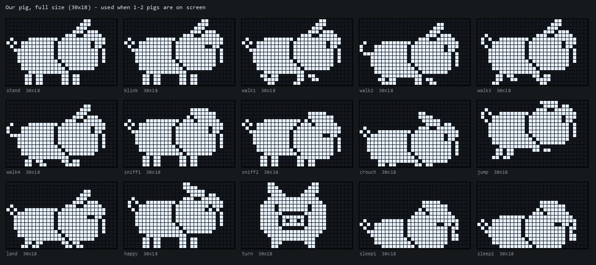

### Friend pig, full size (30×18, outline style)

When there are just two pigs, the friend is drawn as thin line art, so it's easy to tell which pig is yours. The head, with its square snout, nostril and lit eye, was drawn by hand; the body outline is traced from the solid body.

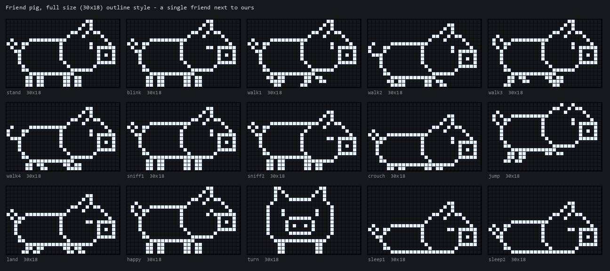

### Medium pig (22×13): 3–4 pigs on screen

Built the same way as the big pig, with a smaller body, a hand-drawn 11-pixel-wide head, and a hand-drawn front view. With 3 or more pigs, everyone (yours and friends) uses solid pigs with black edges; yours is the one leading at the front.

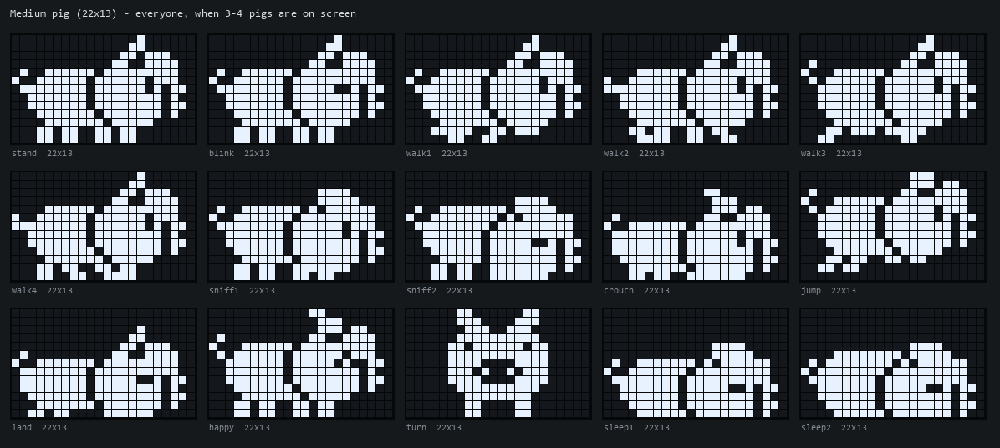

### Small pig (16×10): 5–6 pigs on screen

1-pixel legs and an 8-pixel-wide head, the smallest size that still reads as a pig: the snout and ear are still distinct.

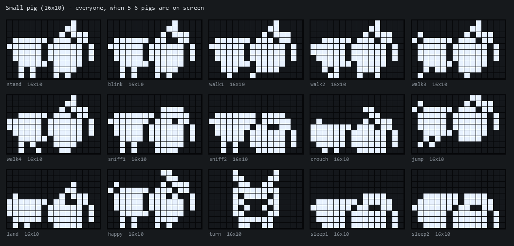

### For comparison: the original pig (27×17)

The upstream firmware drew its pig every frame from circles, boxes and a triangle, with a 2-frame walk where only the feet slid 1 pixel.

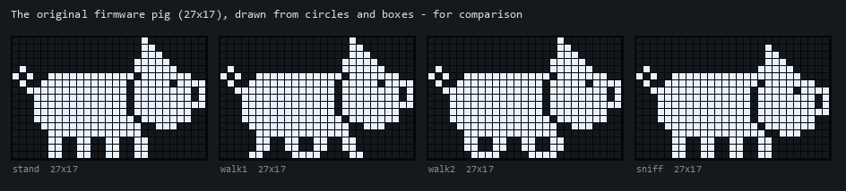

### The six looks

Every node's pig gets one of **six spot patterns**: plain, a big patch, two spots, a saddle stripe, freckles, or a rump patch with a shoulder spot. Each pattern is a list of discs in body coordinates (0 = tail end, 1 = head end), defined once in [tools/sprites/spots.py](tools/sprites/spots.py). The generators stamp it onto every frame at every size, right after drawing the body and before the head, so the spots move with the body in every pose: walking, jumping, squashing and sleeping. Solid pigs get black spots; the outline friend gets lit spots inside its outline.

A spot pixel is only drawn where the pixel and all four of its neighbours are body. So spots never touch the outline, and all six looks share the same masks and edges. Only the frames are stored six times: `PIGL_FRAMES[PIG_LOOKS][PF_COUNT][18]`, and the same for the other sets.


Which look a pig gets is explained in [section 10](#10-the-flock).

### Scenery and effects

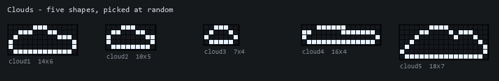

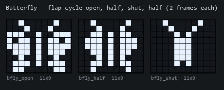

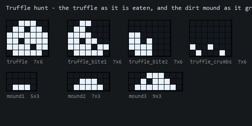

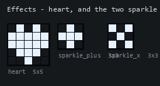

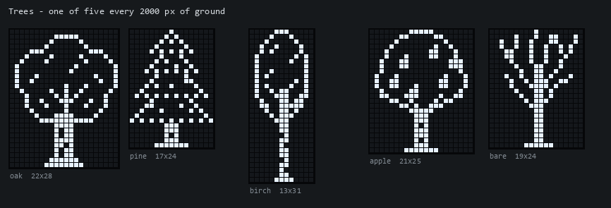

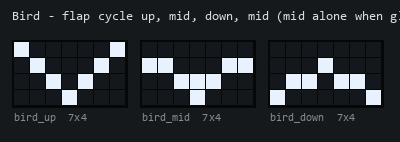

---

## 8. The animations, one by one

All the animations below were recorded from the Sprite Lab ([section 13](#13-the-sprite-pipeline-and-the-sprite-lab)), whose scene code mirrors `oledTick()`. They play at the real speed of 20 fps. Times are given in frames (f); 20 f = 1 second.

### Walk cycle


The four walk frames step the legs in **diagonal pairs**, like a real trot. Each leg is 2 pixels wide and 3 tall, and a "hoof" row at the bottom slides forward or back:

| Frame | Back-far leg | Back-near leg | Front-far leg | Front-near leg | Tail |
|---|---|---|---|---|---|
| `walk1` | lifted | back | back | lifted | curl 1 |
| `walk2` | forward | planted | planted | forward | curl 2 (body 1 px lower) |
| `walk3` | back | lifted | lifted | back | curl 3 |
| `walk4` | planted | forward | forward | planted | curl 2 (body 1 px lower) |

Each frame shows for 2 f, so a full stride takes 400 ms. While walking, the **world scrolls 1 pixel per frame (20 px/s)** under the pig instead of the pig moving across the screen. The body drops 1 px on `walk2`/`walk4`, a slight bob as the weight lands, and the tail changes curl every frame of the cycle.

### Hop (a new network)

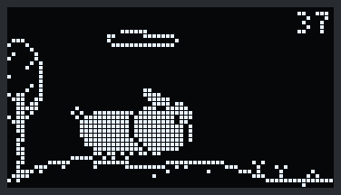

| Frames | Pose |
|---|---|
| 0–1 | `crouch` (squash down to push off) |
| 2–13 | `jump`, rising and falling along a parabola: `dy = round(i·(11−i) / 30.25 · H)` for `i = 0..11`. The peak height `H` is 13 px for a full-size pig, 10 medium, 8 small. The world scrolls **2 px/frame** during the jump, so the hop carries the pig forward. A `!` floats above its head. |
| 14–15 | `land` (squash, eye shut) |
| 16–25 | `happy` |
| 26–27 | `stand` |

### Sniff

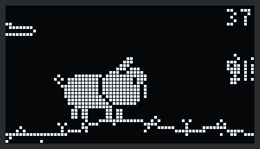

The pig stops (3 f), dips its nose four times, alternating `sniff1`/`sniff2` every 4 f (32 f), pauses (4 f), blinks (2 f) and pauses again (6 f). That's 47 f, about 2.3 s, and the ground doesn't move.

### Turn

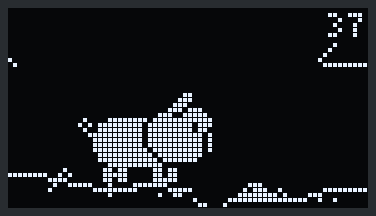

Stand (3 f), face the viewer with the `turn` frame (4 f, flipping direction on the last one), stand (2 f). Afterwards the world scrolls the other way and the pig drifts to its side of the screen.

### Truffle hunt (180 frames, 9 s)

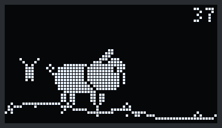

The longest animation, played by `digAt(k)` one frame at a time:

| Frames | What happens |
|---|---|
| 0–5 | Stops |
| 6–21 | Sniffs around slowly; from frame 14 a `?` appears |
| 22–27 | Stands still with `!` (found it) |
| 28–75 | **Roots** with its snout: `sniff1`/`sniff2` every 2 f. Two dirt particles fly from the snout every other frame. At frame 30 **a hole opens** in the ground in front of the snout: the ground line dips into a U-shape 7 px wide. The **mound** beyond the hole grows at frames 40, 54 and 68 (5, then 7, then 9 pixels wide). |
| 76–87 | The truffle **rises out of the hole**, one more row showing every 3 frames. Rows below the ground line aren't drawn, so it emerges from underground. |
| 88–99 | It **pops up** along the arc `2,5,7,9,10,10,9,7,5,3,1,0` px, with two sparkles swapping between `+` and `x` every 4 frames, and a `!` over the pig |
| 100–111 | It lands and bounces (`1,2,1,0`). The pig does a small **happy hop** (`0,2,4,5,4,2` px); sparkles continue for 8 more frames. |
| 112–117 | Pause |
| 118–153 | **Three bites**, 12 f each: head down 4 f, head up 4 f, stand 4 f. On the third frame of each bite, the truffle goes to its next stage (whole → bitten → half → crumbs) and 3 crumbs fly off. |
| 154–157 | The crumbs lie there |
| 158–175 | `happy`, and a **heart** floats up from its head |
| 176–179 | Blinks |

The hole and mound stay in the world after the pig trots on, and scroll away with the ground. They're kept in world coordinates (`site.hx`, `site.mx`) and forgotten once they're more than 40 px off screen. A dig only starts if `treeBetween()` finds no tree over the dig site, so the truffle never gets lost in a trunk.

Dirt and crumbs are simple particles: position, speed, and gravity of 0.2 px/frame². Each disappears when it hits the ground or leaves the screen. Up to 16 can be in the air at once.

### Search (no Core)

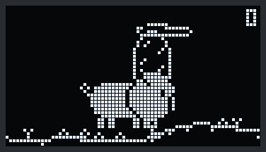

A 96-frame (4.8 s) loop in the middle of the screen: sniff 16 f → turn and flip (4 f) → stand with a blinking `?` (28 f, blinking its eye on frames 30–31) → sniff 16 f → turn and flip back (4 f) → stand with `?` (28 f, blinking on frames 80–81).

### Sleep

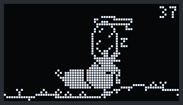

`sleep1`/`sleep2` swap every 24 f (1.2 s), so the body rises and falls as it breathes. Three `z`s drift up and to the right, staggered by 26 f; each becomes a capital `Z` as it rises and disappears after 64 f. A new network or a party wakes the pig.

### Hearts

Hearts appear after a truffle and at parties (one per pig, with random 0–7 f delays so they don't move in lockstep). Each rises 1 px every 3 frames, sways ±1.5 px on a sine wave, blinks for its last 10 frames, and is gone after 44 frames. Up to 8 at once.

---

## 9. The world: ground, trees, clouds, butterfly

### Ground

The ground is endless, and nothing about it is stored. Everything is **worked out from the world position** `wx = screen x + scroll offset gx`, so the same spot always looks the same when you walk back to it.

- **Height:** `hill(wx) = clamp(round(2.4·sin(0.07·wx) + 1.2·sin(0.19·wx + 1)), −4, +2)`. The ground line sits at row `36 + hill`: hilltops rise as high as row 32, and dips go down to row 38. Two sine waves at unrelated frequencies make hills that never visibly repeat. Where the ground steps by more than one row between neighbouring columns, the gap is filled in, so the line never breaks.
- **Details:** a hash of `wx` places **pebbles** 1–2 rows below the line (1 column in 7), **grass tufts** (`^` shapes, 1 in 29) and **sprouts** (`Y` shapes, 1 in 53). The hash is the same integer hash used in the Sprite Lab, so the preview and the device show identical ground.

### Trees

The world is split into **2000-pixel cells**. Each cell holds exactly one tree, one of **five kinds** (chosen by the cell's hash), somewhere in the cell's first 200 pixels:

- an **oak**, with a round crown, branches and leaf marks,
- a **pine**, with four zigzag tiers,
- a tall, narrow **birch**, with a striped trunk,
- an **apple tree**, with fruit in its crown,
- a **bare** winter tree, only trunk and forking branches.

 Trees are at least 1800 px apart: about **90–110 s** of trotting, more with stops. A tree stands on the ground height under its middle. It's drawn behind the pigs, and the pigs' masks hide the parts behind them.


### Clouds

Each node has **1–3 clouds** (chosen at boot). Each cloud has its own randomly chosen:

- **shape**, one of the five,
- **height**, rows 1–13,
- **wind speed**, 0.02–0.07 px/frame to the left, always, even while the pig stands,
- **depth**, 0.12–0.37: the fraction of the ground's scroll speed it moves at. That's parallax, so lower-depth clouds look farther away.

When a cloud leaves the screen it's replaced by a new random one, up to 90 px beyond the opposite edge. That leaves gaps of varying length, so the sky never repeats.

### Birds

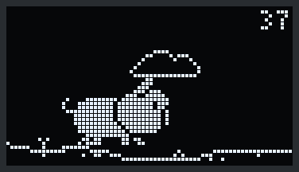

About every **20–60 s**, a bird crosses the sky: 7 of 10 times alone, otherwise a loose V of 2–3. It flies at **1.2–1.8 px/frame**, two to three times the butterfly's speed, at rows 3–12. Followers trail 9 px behind the leader and a little lower. The wings cycle up → mid → down → mid, 2 frames each, with each bird out of step with the others. About 2% of frames start a **glide** of 10–19 frames, wings held level. Each bird bobs 1 px on a slow sine wave. Birds scroll with 0.4× parallax, and they're drawn after the clouds and before the trees.


### Butterfly

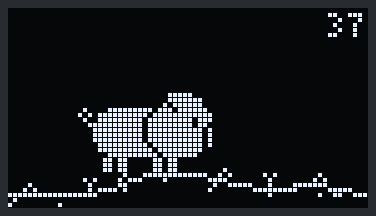

About every **10–40 s** an 11×9 butterfly enters from a random side at a random height (rows 8–25, kept within rows 1–24 as it bobs). It moves at 0.45–0.8 px/frame and bobs on two sine waves, `3·sin(p) + 4·sin(0.37·p)` with `p` growing 0.25 per frame, so its path is uneven like a real butterfly's. While the pig walks, it also drifts with the scenery at **half the ground speed**, which places it at about the pig's distance. The wings cycle open → half → shut → half, 2 frames each. It's drawn **behind** the pigs.

---

## 10. The flock

Every nearby friend node (up to 5) joins your pig on screen, so the number of pigs *is* the number of nodes in the cluster, up to 6.

| Pigs | Size | Your pig | Friends | Spacing | Back-row rise |
|---|---|---|---|---|---|
| 1–2 | Full (30×18) | Solid | Outline | 22 px | 3 px |
| 3–4 | Medium (22×13) | Solid, with edge | Solid, with edge | 12 px | 7 px |
| 5–6 | Small (16×10) | Solid, with edge | Solid, with edge | 9 px | 6 px |

<p>
  
  
  
</p>

**Formation.** Your pig is **slot 0**, leading near the front edge: `lead = 72 − w − gap` when facing right, where `gap` is 12 px at full and medium size and 10 px at small size. Friend `i` sits at `lead − dir · spacing · i`. Odd slots form a **back row**, drawn first and raised a few pixels. Even slots form the front row. So 6 pigs make two rows of three, and every head stays visible.

**Looks.** Each pig's spot pattern comes from a hash of its node's hardware address: a 32-bit FNV-1a hash, modulo 6 (`lookHash()`). Two nodes could hash to the same look, so `assignLooks()` goes through the pigs on screen in address order, and any pig whose look is already taken moves to the next free one. Every node sorts the same addresses the same way, so each pig looks the same on every screen, and all the pigs in one scene look different. With both of your nodes, **57C4 has freckles and 58A8 has the saddle stripe**. A pig leaving the flock keeps its look until it's off screen.

**Joining and leaving.**

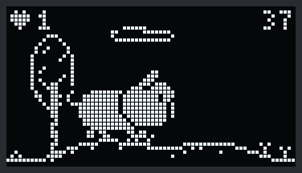

- **Joining:** a newly heard friend trots in from behind, at 2 px/frame until it's within 20 px of its slot, then 1 px/frame. Its name floats over it for 3.5 s (at 1–4 pigs; with 5–6 there's no room). Friends join one at a time, at most one every 1.25 s.
- **Leaving:** a friend not heard for 45 s trots off behind the flock at 2 px/frame.
- **Size changes:** when the count crosses a size boundary, everyone switches size at once and walks to their new slots.

**What friends do.** Each friend pig picks its frame in this order:

1. **Party:** copy the party frame.
2. **Sleep:** sleep, breathing out of step with the others.
3. **Its own hop:** its node found a network.
4. **Walk:** walk if it's moving to its slot or the world is scrolling. Each friend's walk cycle is offset so their legs aren't in sync.
5. **Turn:** turn when your pig turns.
6. **Search mode:** sniff now and then.
7. **Otherwise:** stand, with the occasional blink.

### Parties

<p>
  
  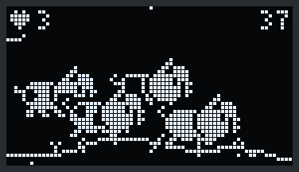
  
</p>

Every pig on every node jumps at the same moment ([section 5](#5-friends-flocks-and-parties-the-node-to-node-protocol) explains how they sync). The size of the party matches the size of the flock:

| Pigs | Jumps | Extras |
|---|---|---|
| 2 | 1 | A heart over each pig |
| 3–4 | 2 | Hearts, plus **confetti** falling through the whole party |
| 5–6 | 3 | Hearts, confetti, and a **firework** at the top of every jump |

Each jump takes 20 f: the 16-frame hop plus 4 f of `happy`. After the jumps come 18 f of `happy` (with the hearts) and 6 f of `stand`.

- **Confetti:** one piece every other frame, starting just above the top edge and drifting down at 0.35–0.7 px/frame with a sideways wobble.
- **Fireworks:** 10 sparks flying out in a ring from a random point in the sky, slowing under light gravity, gone after 12 frames.

Confetti and fireworks share a pool of 48 particles.

---

## 11. Burn-in protection

OLED pixels wear with use, so a pixel that stays lit for weeks leaves a ghost image. This node may run for weeks, so:

- **Rolling ground:** the ground line moves between rows 32 and 38 as the pig walks, so no row stays lit.
- **Creeping ground:** when the pig stands still (sleeping, sniffing, searching), the ground still creeps **1 px every minute**.
- **Moving scenery:** clouds always drift, and the pig, trees and butterfly all move.
- **Small fixed text:** the only fixed elements are the small network count and the friend badge in the corners.

---

## 12. The stats page and the channel graph

### Stats

Four panels rotate every **4 s**. The lit title bar has four dots; the tall one marks the current panel.

| Panel | Line by line |
|---|---|
| **PIGLET 57C4** | Firmware version · uptime · Core name and scanned channel range (or `core: searching`) · time since linking (or how often it's asking for a Core) · free memory |
| **NETWORKS** | Unique networks (plus a per-hour rate after 5 minutes linked) · total seen · total sent to the Core · unique networks that are open / WEP / enterprise (EAP) · WPA/WPA2 / WPA3 |
| **FLOCK n PIGS** | Up to 4 nearby friends, each as `name signal time-since-heard n<networks>` · number of parties. A `*` in the title means this node is the party leader. |
| **AIR** | Current channel (scanning, or on channel 6 for the Core) · busiest channel and its network count · strongest recent network: signal and channel, then its name · time since the last new network |

The strongest-network entry is replaced by any louder network, or by the next one heard once the entry is a minute old. The security breakdown only counts networks found since the last boot.

### Channel graph

14 bars, one per 2.4 GHz channel, each 4 px wide. Each bar's height is the number of networks the latest scan found on that channel, scaled so the busiest channel fills the height. Any channel with at least one network shows at least one pixel. The channel being scanned right now is drawn hollow. Under the bars, a solid line marks the channels assigned to this node and a single dot marks the others. The top line names the busiest channel.

While the graph or stats page is showing, the pig pauses; it continues when you return.

---

## 13. The sprite pipeline and the Sprite Lab

All the pixel art is kept as text (`#` = lit, `.` = off, `x` = forced black) in Python scripts under [tools/sprites](tools/sprites), and turned into C by a generator. **Never edit `src/pig_sprites.h` by hand**: rebuild it.

```sh
cd tools/sprites
python build_sprites.py        # rebuilds frames.json, world.json and ../../src/pig_sprites.h
cd ../sprite-lab
python build_lab.py            # rebuilds the Sprite Lab page with the new art
```

| File | What it does |
|---|---|
| `current.py` | A Python port of U8g2's circle, disc and rounded-box drawing. Used to rasterise the original pig, and for the rounded body of the new pigs. |
| `gen.py` | Builds the **full-size solid pig**. The body is a rounded box; the head is hand-drawn (`TOPS` for the ear variants up/back/flop, `BOT` for the face and snout). Also defines the leg poses (planted, forward, back, lifted, and tucked/stretched for the jump), the three tail curls, the three eye states (open, shut, happy `^`) and the hand-drawn front view. `sheet()` lists the 15 frames as combinations of these. Pieces marked to separate from the body get a 1 px black gap to its left and below. |
| `genB.py` | The **outline friend pig**: a hand-drawn outline head plus the traced outline of the body. |
| `gen_sizes.py` | The **medium and small pigs**, built the same way from smaller bodies, heads and front views. |
| `spots.py` | The six spot patterns (looks), and `stamp()`, which draws one inside a body without touching its outline. |
| `trees.py`, `pine.txt` | The oak (circles for the crown, with branches and leaf ticks), birch (tall oval crown, striped trunk), apple (round crown with fruit) and bare tree (drawn with lines). The pine is hand-drawn in `pine.txt`. |
| `world_assets.py` | Clouds, butterfly, bird, truffle stages, heart, sparkles, mounds and trees → `world.json`. |
| `export.py` / `addsizes.py` | Pig frames for every look → `frames.json`. Look 0 is stored under `solid`, `outline`, `solidM` and `solidS`; looks 1–5 add `_v1` to `_v5`. |
| `mkheader.py` | `frames.json` + `world.json` → `pig_sprites.h`. Packs each row into a `uint32_t`, computes each frame's **mask** (flood-filled silhouette) and **edge** (the mask grown 1 px, stored 2 px wider), writes the `PigFrame` enum, and stores six frame sets per pig set (one per look). |
| `render.py` | Quick preview: renders a text file of frames to a zoomed PNG. |
| `render_docs.py` | Makes the images in this README. |

**The Sprite Lab** ([tools/sprite-lab/piglet-sprite-lab.html](tools/sprite-lab/piglet-sprite-lab.html)) is a single web page. Open it in a browser to see everything running on a simulated 72×40 OLED at 20 fps, next to a real-size preview. You can switch mode (searching, linked, idle), trigger network finds and parties, and set the cluster size from 1 to 6 nodes. It also shows the original pig and two earlier design options for comparison. Its scene code (`WorldPig`) follows the firmware's `oledTick()` closely. The preview uses shorter timers so you see digs, visits and butterflies sooner.

To regenerate the README images:

```sh
cd tools/sprites && python render_docs.py                # sprite sheets and diagrams
cd ../sprite-lab && node sim_gifs.js                      # records every animation from the lab
cd ../sprites && python render_docs.py gifs              # turns the recordings into GIFs
```

---

## 14. Code map

Everything runs from [src/main.cpp](src/main.cpp). `loop()` calls, every 10 ms:

| Function | Job |
|---|---|
| `nodeTick()` | Core discovery, Core timeout, backup heartbeat, and running `scanTick()` |
| `ledTick()` | LED blink rate |
| `buttonTick()` | Short press = next page; 2 s hold = search for a Core again |
| `statusTick()` | Serial status every 10 s |
| `friendsTick()` | Processes a friend heartbeat left by the receive callback |
| `oledTick()` | Draws a frame every 50 ms |

The file in order:

| Section | Main pieces |
|---|---|
| Board and protocol constants | Pins, the `ENOW` magic, timing constants, message types, `jcmk_text_msg_t` and `jcmk_admin_msg_t`, the `CHANNELS` table |
| Node state | Link state, assignment, counters, scan state, per-channel counts, page, stats bookkeeping |
| Helpers | `effRange()` (2.4 GHz trimming and fallback), `markSeen()` (unique-network hash set), LED |
| Drawing basics | `oledMessage()`, `blit()`, `groundHash()`, `safePixel()`, `rnd()`/`rndf()`/`floorDiv()` |
| World | Clouds (`newCloud`, `cloudsTick`), birds (`birdsTick`), ground (`hill`, `groundAt`), trees (`TREE_SHAPES`, `treeIn`, `treeBetween`), dig site, `drawWorld()` |
| Creatures and effects | `butterflyTick()`, the truffle-hunt timeline `digAt()`, dirt (`spawnDirt`, `dirtTick`), hearts (`addHeart`, `heartsTick`), `drawCounter()` |
| Pages | `drawGraphPage()`, `drawStatsPage()` (with `fmtDur()`) |
| Friends | `Friend` table, `FriendMsg`, party state, `friendName()`, `friendNear()`, `isLowest()`, `friendsTick()` |
| Pig rendering | `PigSet` (frames for six looks, plus masks and edges, per size), `FlockSize`, `drawPig()`, looks (`lookHash`, `assignLooks`), `hopAt()`, `partyAt()`, sparks (`addSpark`, `sparksTick`), the `herd` of friend pigs |
| `oledTick()` | Flock bookkeeping → party scheduling → mode → action → scrolling → formation → drawing, in the layer order from [section 6](#6-the-display-engine) |
| Radio | `setChannel()`, `addPeer()`, `sendRequest()`, `sendHeartbeat()` (with the friend payload), `sendText()`, `authStr()` |
| `onRecv()` | ESP-NOW receive callback: Core reply, `ADMIN`, Biscuit config, Core and friend heartbeats |
| Node logic | `resetToSearching()`, `scanTick()`, `nodeTick()`, `statusTick()`, `buttonTick()` |
| `setup()` / `loop()` | Startup and the main loop |

[src/pig_sprites.h](src/pig_sprites.h) (generated) holds the `PigFrame` enum, the four pig sets (`PIGL`, `FRIENDL`, `PIGM`, `PIGS`, each with `_FRAMES` for six looks, and `_MASKS` and `_EDGES`), and every scenery bitmap with its `_W`/`_H` size.

---

## 15. Memory, limits and known behaviour

- **Flash:** about 80% of the 1.25 MB app partition. Almost all of it is the Wi-Fi and ESP-NOW stack. All the sprites together are about 29 KB: six looks of frames for four pig sets, their masks and edges, and the scenery. **RAM:** about 13%.
- **2.4 GHz only.** The C3 has no 5 GHz radio. Assignments of only 5 GHz channels fall back to channels 1–14.
- **Unique-network limit.** The unique count stops at 896 networks per boot (see `markSeen()`), and so do hops. Scanning and reporting continue.
- **Friend timing.** Nodes hear each other only when both happen to be on channel 6, so a new friend can take a few seconds to appear. A node that misses a party countdown sits that party out.
- **Nothing is saved.** The friend table, party count and stats are all lost when the node restarts.
- **Pig pauses on other pages.** While the graph or stats page is showing, the pig doesn't move and new-network hops aren't queued for later.

---

## 16. Credits and license

A port of [PigletNode](https://github.com/Hamspiced/piglet/tree/main/PigletNode) by Hamspiced, from the XIAO ESP32-C5 to the ESP32-C3 0.42" OLED board, with a new display engine, pixel art, animations and node-to-node flock features. Works with Piglet (XIAO ESP32-S3/C5/C6) and Piglet T-Dongle C5 in Core mode, and with [ESP32 Marauder](https://github.com/justcallmekoko/ESP32Marauder) in its core role.

Licensed under **CC BY-NC-SA 4.0**, the same as upstream.
